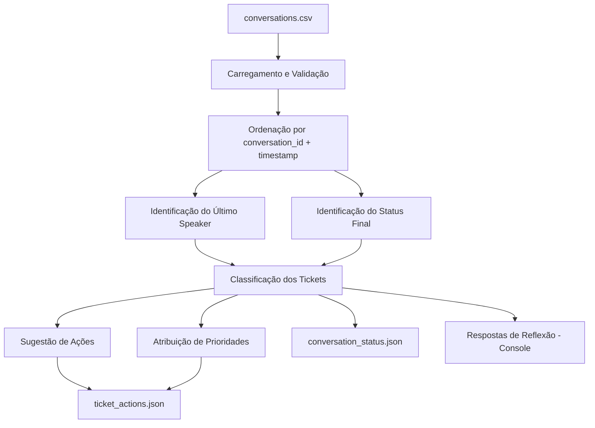
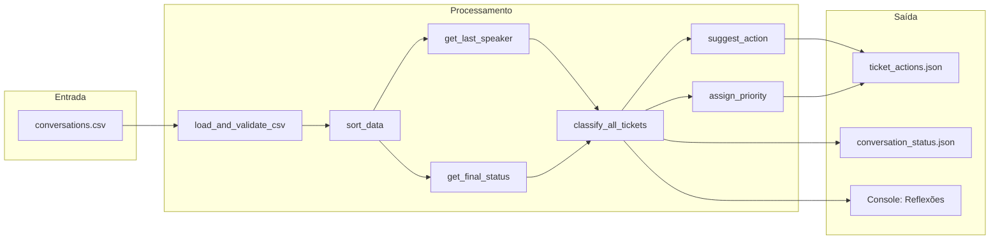

# Documento de Design — Ghost User Detection

## Visão Geral

O sistema de Detecção de Ghost Users é um pipeline de processamento de dados em Python que analisa conversas de suporte ao cliente a partir de um arquivo CSV (`conversations.csv`), identifica padrões de abandono (ghost users), classifica tickets e gera recomendações de ações em formato JSON.

O fluxo principal é:
1. Carregar e validar o CSV
2. Ordenar dados cronologicamente
3. Identificar último speaker e status final por ticket
4. Classificar tickets segundo regras de negócio
5. Sugerir ações de reengajamento
6. Atribuir prioridades (opcional)
7. Gerar arquivos JSON de saída
8. Imprimir respostas de reflexão

O sistema será implementado como um script Python único (`ghost_detector.py`) no diretório `exemplos_exercicios/exercicio_2/`, utilizando `pandas` para manipulação de dados e a biblioteca padrão `json` para serialização.

## Arquitetura

O sistema segue uma arquitetura de pipeline linear, onde cada etapa transforma ou enriquece os dados para a próxima.



### Decisões de Arquitetura

- **Script único**: A complexidade do sistema não justifica múltiplos módulos. Um único arquivo com funções bem definidas mantém a simplicidade e alinhamento com o padrão do exercício 1.
- **Pandas como engine**: O `requirements.txt` já inclui `pandas==2.2.2`. DataFrames são ideais para agrupamento, ordenação e extração de últimas linhas por grupo.
- **Funções puras para lógica de negócio**: As funções de classificação e sugestão de ação são puras (sem side effects), facilitando testes.
- **Sem dependência de LLM**: Diferente do exercício 1, este sistema é determinístico — não usa a API da Anthropic. As respostas de reflexão são geradas programaticamente com base nos dados.

## Componentes e Interfaces

### Funções Principais

```python
def load_and_validate_csv(filepath: str) -> pd.DataFrame:
    """
    Carrega o CSV e valida colunas obrigatórias.
    Converte timestamp para datetime.
    Levanta SystemExit com mensagem descritiva em caso de erro.
    """

def sort_data(df: pd.DataFrame) -> pd.DataFrame:
    """
    Ordena por conversation_id (crescente) e timestamp (crescente).
    Retorna novo DataFrame ordenado sem perda de dados.
    """

def get_last_speaker(df: pd.DataFrame) -> pd.DataFrame:
    """
    Para cada conversation_id, retorna DataFrame com colunas:
    [ticket_id, conversation_id, speaker] da última mensagem.
    """

def get_final_status(df: pd.DataFrame) -> pd.DataFrame:
    """
    Para cada ticket_id, retorna DataFrame com colunas:
    [ticket_id, ticket_status] da última mensagem.
    """

def classify_ticket(last_speaker: str, final_status: str) -> str:
    """
    Aplica regras de classificação:
    - atendente + pending → precisa_follow_up
    - atendente + closed → encerrado
    - client + solved → resolvido
    - atendente + open → risco
    - client + !solved → ativo
    """

def classify_all_tickets(last_speakers: pd.DataFrame, final_statuses: pd.DataFrame) -> list[dict]:
    """
    Combina último speaker e status final para classificar todos os tickets.
    Retorna lista de dicts: [{"ticket_id": int, "status": str}, ...]
    """

def suggest_action(classification: str) -> str:
    """
    Mapeia classificação para ação:
    - precisa_follow_up → send_follow_up
    - risco → monitor
    - encerrado/resolvido/ativo → no_action
    """

def assign_priority(classification: str, final_status: str) -> str:
    """
    Atribui prioridade:
    - risco (ghost + open) → high
    - pending → medium
    - closed/solved → low
    """

def generate_json(data: list[dict], filepath: str) -> None:
    """
    Serializa lista de dicts em JSON com indent=2 e encoding UTF-8.
    """

def print_reflections(classified_tickets: list[dict], df: pd.DataFrame) -> None:
    """
    Imprime respostas de reflexão no console baseadas nos dados reais.
    """

def main() -> None:
    """
    Orquestra o pipeline completo.
    """
```

### Fluxo de Dados entre Componentes



## Modelos de Dados

### Estrutura do CSV de Entrada

| Coluna            | Tipo     | Descrição                                    |
|-------------------|----------|----------------------------------------------|
| `ticket_id`       | int      | Identificador único do ticket                |
| `conversation_id` | int      | Identificador da conversa dentro do ticket   |
| `user_id`         | int      | Identificador do usuário                     |
| `speaker`         | str      | `client` ou `atendente`                      |
| `message`         | str      | Texto da mensagem                            |
| `timestamp`       | datetime | Data/hora da mensagem                        |
| `ticket_status`   | str      | `open`, `pending`, `solved` ou `closed`      |

### Colunas Obrigatórias para Validação

```python
REQUIRED_COLUMNS = [
    "ticket_id", "conversation_id", "user_id",
    "speaker", "message", "timestamp", "ticket_status"
]
```

### Estrutura de Saída: conversation_status.json

```json
[
  {"ticket_id": 1001, "status": "encerrado"},
  {"ticket_id": 1002, "status": "resolvido"}
]
```

### Estrutura de Saída: ticket_actions.json

```json
[
  {"ticket_id": 1001, "action": "no_action", "priority": "low"},
  {"ticket_id": 1005, "action": "send_follow_up", "priority": "medium"}
]
```

### Regras de Classificação (Tabela de Decisão)

| Último Speaker | Status Final | Classificação       | Ação Sugerida    | Prioridade |
|----------------|-------------|---------------------|------------------|------------|
| atendente      | pending     | precisa_follow_up   | send_follow_up   | medium     |
| atendente      | closed      | encerrado           | no_action        | low        |
| client         | solved      | resolvido           | no_action        | low        |
| atendente      | open        | risco               | monitor          | high       |
| client         | ≠ solved    | ativo               | no_action        | *          |

> *Nota: Para tickets `ativo`, a prioridade segue a regra do status final (pending → medium, closed → low, etc.). Na prática, como `ativo` implica `client` + status ≠ `solved`, o status será `open` ou `pending`. Se `pending` → medium; se `open` → não se encaixa explicitamente nas regras de prioridade do Requisito 9, então trataremos como `medium` por padrão (status `open` com client ativo indica ticket em andamento).

### Valores Válidos

```python
VALID_SPEAKERS = {"client", "atendente"}
VALID_STATUSES = {"open", "pending", "solved", "closed"}
CLASSIFICATIONS = {"precisa_follow_up", "encerrado", "resolvido", "risco", "ativo"}
ACTIONS = {"send_follow_up", "monitor", "no_action"}
PRIORITIES = {"high", "medium", "low"}
```
